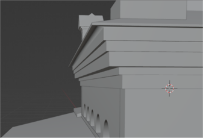

# vr-reconstruction
## VR-реконструкция церкви св. Ольги в Дудергофе
### Введение
16 сентября 1879 года на Вороньей горе было положено начало строительству церкви в Дудергофе.
В конце 1930-х гг. в церкви святой Ольги вспыхнул пожар, который произошел из-за неосторожного обращения с огнем.
В настоящее время церковь восстановлению не подлежит, однако стало реальным сделать ее виртуальную реконструкцию.

### Сохранившиеся архивы
Чертежи

Фотографии

### Анализ местности

### Работа с чертежами

### Блокинг в Revit

### Детализация в Blender

### VR-сцена
Подбор моделей

Сборка сцены

Моделиррвание ландшафта

Настройка освещения

Настройка под VR

# Рендеры
Финальные рендеры можно посмотреть в соответствующей папке

Финальное видео: https://drive.google.com/file/d/1TqANnB4w_RYn-TD_PoW8oGEdxEvi1VeI/view?usp=sharing

Видео из VR: https://drive.google.com/file/d/1unxCNk5QTFK4mOOaG0uWs3RtLc43rKUk/view?usp=sharing

